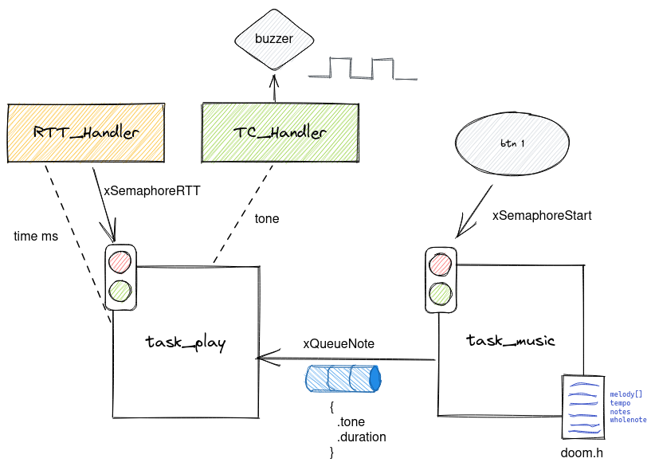

# 22b - AV4 - APS1

Nesta avaliação vocês irão refazer parte da APS1 musical, só que agora usando os periféricos de relógio para contar os tempos.

## Descrição

Periféricos:

- PIO
- TC
- RTT

freeRTOS:

- Task
- Queue
- Semaphore

### APS1 - musical

Criar um sistema embarcado que toca **uma única** música monofônica porém usando os relógios do nosso microcontrolador para contar tempo e fazer o buzzer vibrar!. 

<div align="left">
      <a href="https://youtu.be/YXoXfl5-GMk">
         
      </a>
</div>

### Firmware

Vocês devem desenvolver o firmware como indicado a seguir:



**O código base fornecido é o `RTOS-OLED-Xplained-Pro` já com o RTT e TC adicionado no wizard.**

Onde:

- Btn 1
  - devem ser configurados para funcionar com `callback`
  - deve liberar o semáforo para começar tocar a música

- Buzzer
  - Controla o pino do buzzer emitindo o som
  
- `TC_Handler`
  - Vibrar buzzer na frequência definida na nota
 
- `RTT_Handler`
  - Deve contar o tempo da duração da nota.
  - Libera o semáforo `xSemaphoreRTT` indicando o fim da duração da nota

- `xSemaphoreStart`
  - Semáforo que indica que a música deve começar
  
- `xQueueNote`
  - Fila de struct do tipo `Note` que contém: `tone` frequência do buzzer e `duration` duração em ms da nota.

- `xSemaphoreRTT`
  - Indica o fim da duraão de uma nota

- `task_music`
  - Uma vez liberado o semáforo (`xSemaphoreStart`) começa enviar a informaćão das notas para a fila `xQueueNote` 
  - A melody da música está em `doom.h` e as informações `tempo`, `notes` e `wholenote` já estão definidas no final do arquivo `doom.h`.
  - Quando a música acabar, deve parar de enviar e só voltar quando o bot
  
- `task_play`
  - Deve receber as notas pela fila (`xQueueNote`) e configurar o `TC` e o `RTT` 
      - `TC`: gera o tom no buzzer
      - `RTT`: conta o tempo de duracão da nota
  - Deve aguardar o `xSemaphoreRTT` para ler o valor da fila e reproduzir a próxima nota
  
- `TC`
  - Se usar o `pin_toggle` a frequência do TC deve ser 4x o tom da nota
  
### Dicas

Releia o roteiro da [APS1](https://insper.github.io/ComputacaoEmbarcada/navigation/APS/APS-1-Musical-software/) e recupere o seu código da entrega da APS, você pode adaptar parte do código dele.

1. Crie as tasks e as iniialize 
1. Buzzer: Configure o pino do buzzer e teste
1. Btn: Configure o botão e seu callback
1. `task_music`
    1. Implemente a parte da leitura e processamento da nota
    1. Implemente o semáforo `xSemaphoreStart` e o botão (e a lógica de começar enviar quando o botão for apertado)
    1. Crie a struct `Note` e a fila `xQueueNote`
    1. Começe enviar as notas para a fila
1. `task_play`
    1. Faça o recebimento da fila `xQueueNote`
    1. Configure o RTT e o TC para cada nota
        - **A frequência do TC deve ser 4x o valor da freq. da nota!!**
    1. Implemente o `xSemaphoreRTT` e a lógica associada a ele
        - Você pode usar `portMAX_DELAY` para esperar um semáforo por um tempo indeterminado.

Lembre de parar de tocar a nota quando o tempo acabar (para isso desligue o TC!)

As configurações da música já foram feitas no `doom.h`, você deve usar isso na `task_music`. Lembre que vocês devem usar o código similar a APS para calcular a duração e varrer a música:

```c
int divider;
int noteDuration;
for (int thisNote = 0; thisNote < notes * 2; thisNote = thisNote + 2) {
      // calculates the duration of each note
      divider = melody[thisNote + 1];
      if (divider > 0) {
            // regular note, just proceed
            noteDuration = (wholenote) / divider;
      } else if (divider < 0) {
            // dotted notes are represented with negative durations!!
            noteDuration = (wholenote) / abs(divider);
            noteDuration *= 1.5; // increases the duration in half for dotted notes
      }
      // note e duration      
}
```

https://github.com/insper-classroom/22b-emb-av4/blob/e4ae3935aac29cb13da2f4086d34aab244cbebd9/RTOS-OLED-Xplained-Pro/src/doom.h#L222-L224
